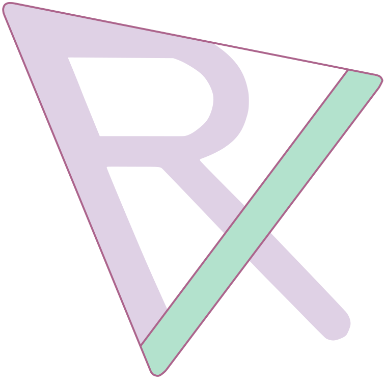

# **RXMesh: GPU-Accelerated Triangle Mesh Processing** 

  

 

RXMesh is a library for processing triangle mesh entirely on the GPU. RXMesh goal is to provide a high-performance, generic, and compact data structure that can handle meshes regardless of their quality (e.g., non-manifold). RXMesh support both **static** and **dynamic** (where mesh connectivity changes) mesh processing operations. Our programming model/API helps to hide the complexity of the data structure and provides an intuitive access model for different use cases.

RXMesh also features a **sparse and dense matrix** infrastructure that is tightly coupled with the mesh data structure. We expose various `cuSolver`, `cuSparse`, and `cuBlas` operations through the sparse and dense matrices, tailored for geometry processing applications.

RXMesh also includes support for **Automatic Differentiation** (AD) directly on the GPU. Built on top of its compact mesh and matrix infrastructure, RXMesh enables efficient computation of gradients and Hessians for geometry processing tasks such as optimization, simulation, and inverse design. This AD system is designed to be modular and fast, allowing users to differentiate through mesh-based computations with minimal overhead.

## **For documentation and instructions, visit [RXMeshDocs](https://ahdhn.github.io/RXMeshDocs/)**