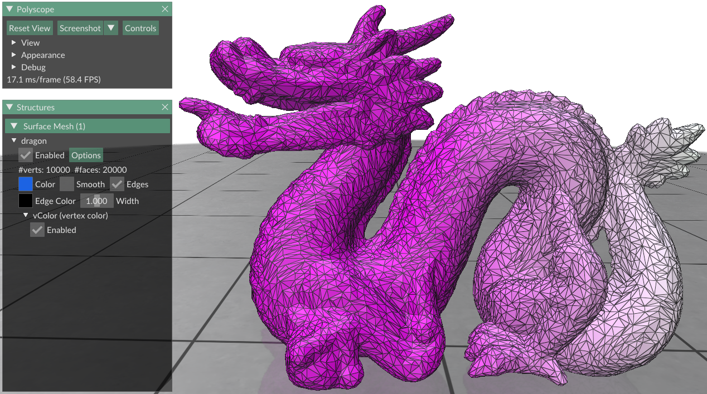

# **RXMesh** [](https://github.com/owensgroup/RXMesh/actions/workflows/Ubuntu.yml) [](https://github.com/owensgroup/RXMesh/actions/workflows/Windows.yml)

<p align="center">
    <br>
</p>

## **Contents**
- [**About**](#about)
- [**Compilation**](#compilation)
  * [**Dependencies**](#dependencies)
- [**Organization**](#organization)
- [**Programming Model**](#programming-model)
  * [**Computation**](#computation)
  * [**Structures**](#structures)
  * [**Viewer**](#viewer)
- [**Replicability**](#replicability)
- [**Bibtex**](#bibtex)

## **About**
RXMesh is a surface triangle mesh data structure and programming model for processing static meshes on the GPU. RXMesh aims at provides a high-performance, generic, and compact data structure that can handle meshes regardless of their quality (e.g., non-manifold). The programming model helps to hide the complexity of the data structure and provides an intuitive access model for different use cases. For more details, please check out our paper:

*[RXMesh: A GPU Mesh Data Structure](https://escholarship.org/uc/item/8r5848vp)*<br>
*[Ahmed H. Mahmoud](https://www.ece.ucdavis.edu/~ahdhn/), [Serban D. Porumbescu](https://web.cs.ucdavis.edu/~porumbes/), and [John D. Owens](https://www.ece.ucdavis.edu/~jowens/)*<br>
*[ACM Transaction on Graphics](https://dl.acm.org/doi/abs/10.1145/3450626.3459748) (Proceedings of SIGGRAPH 2021)*

This repository provides 1) source code to reproduce the results presented in the paper (git tag [`v0.1.0`](https://github.com/owensgroup/RXMesh/tree/v0.1.0)) and 2) ongoing development of RXMesh. For 1), all input models used in the paper can be found [here](https://ucdavis365-my.sharepoint.com/:f:/g/personal/ahmahmoud_ucdavis_edu/En-vEpIdSGBHqvCIa-MVXRQBg5g7GfM3P3RwZBHL4Hby3w?e=2EVnJd). Models were collected from [Thingi10K](https://ten-thousand-models.appspot.com/) and [Smithsonian 3D](https://3d.si.edu/explore) repository. 

## **Compilation**
The code can be compiled on Ubuntu (GCC 9) and Windows (Visual Studio 2019) providing that CUDA (>=11.1.0) is installed. To run the executable(s), an NVIDIA GPU should be installed on the machine.

### **Dependencies**
- [OpenMesh](https://www.graphics.rwth-aachen.de:9000/OpenMesh/OpenMesh) to verify the applications against reference CPU implementation
- [RapidJson](https://github.com/Tencent/rapidjson) to report the results in JSON file(s)
- [GoogleTest](https://github.com/google/googletest) for unit tests
- [spdlog](https://github.com/gabime/spdlog) for logging

All the dependencies are installed automatically! To compile the code:

```
> git clone https://github.com/owensgroup/RXMesh.git
> cd RXMesh
> mkdir build 
> cd build 
> cmake ../
```
Depending on the system, this will generate either a `.sln` project on Windows or a `make` file for a Linux system.

## **Organization**
RXMesh is a CUDA/C++ header-only library. All unit tests are under `tests/` folder. This includes the unit test for some basic functionalities along with the unit test for the query operations. All applications are under `apps/` folder.

## **Programming Model**
The goal of defining a programing model is to make it easy to write applications using RXMesh without getting into the nuances of the data structure. Applications written using RXMesh are composed of one or more of the high-level building blocks defined under [**Computation**](#computation). In order to use these building blocks, the user would have to interact with data structures specific to RXMesh discussed under [**Structures**](#structures). Finally, RXMesh integrate [Polyscope](https://polyscope.run) as a mesh [**Viewer**](#viewer) which the user can use to render their final results or for debugging purposes. 

### **Structures**
- **Attributes** are the metadata (geometry information) attached to vertices, edges, or faces. Allocation of the attributes is per-patch basis and managed internally by RXMesh. Allocation could be done on host, device, or both. Allocating attributes on the host is only beneficial for I/O operations of initializing attribute and then eventually moving it to the device. 
  - Example: allocation
    ```c++
    RXMeshStatic rx("input.obj");
    auto vertex_color = 
      rx.add_vertex_attribute<float>("vColor", //Unique name 
                                     3,        //Number of attribute per vertex 
                                     DEVICE,   //Allocation place 
                                     SoA);     //Memory layout (SoA vs. AoS)                                 

    ```
  - Example: reading from `std::vector`
    ```c++
    RXMeshStatic rx("input.obj");
    std::vector<std::vector<float>> face_color_vector;
    //....

    auto face_color = 
      rx.add_face_attribute<int>(face_color_vector,//Input attribute where number of attributes per face is inferred 
                                 "fColor",         //Unique name                                
                                 SoA);             //Memory layout (SoA vs. AoS)                                  
    ```
  - Example: move, reset, and copy
    ```c++    
    //By default, attributes are allocated on both host and device     
    auto edge_attr = rx.add_edge_attribute<float>("eAttr", 1);  
    //Initialize edge_attr on the host 
    // ..... 

    //Move attributes from host to device 
    edge_attr.move(HOST, DEVICE);

    //Reset all entries in an attribute to zero
    edge_attr.reset(0, DEVICE);

    auto edge_attr_1 = rx.add_edge_attribute<float>("eAttr1", 1);  

    //Copy from another attribute. 
    //Here, what on the host of edge_attr will be copied into the device side of edge_attr_1
    edge_attr_1.copy_from(edge_attr, HOST, DEVICE);
    ```

- **Handles** are unique identifier for vertices, edges, and faces. They are usually internally populated by RXMesh (by concatenating the patch ID and mesh element index within the patch). Handles can be used to access attributes, `for_each` operations, and query operations. 

  - Example: Setting vertex attribute using vertex handle 
    ```c++  
    auto vertex_color = ...    
    VertexHandle vh; 
    //...
    
    vertex_color(vh, 0) = 0.9;
    vertex_color(vh, 1) = 0.5;
    vertex_color(vh, 2) = 0.6;
    ```

- **Iterators** are used during query operations to iterate over the output mesh element. The type of iterator defines the type of mesh element iterated on e.g., `VertexIterator` iterates over vertices which is the output of `VV`, `EV`, or `FV` query operations. Since query operations are only supported on the device, iterators can be only used inside the kernel. Iterators are usually populated internally. 

  - Example: Iterating over faces 
      ```c++  
      FaceIterator f_iter; 
      //...

      for (uint32_t f = 0; f < f_iter.size(); ++f) {	
        FaceHandle fh = f_iter[f];
        //do something with fh ....
      }
      ```


### **Computation**
- **`for_each`** runs a computation over all vertices, edges, or faces _without_ requiring information from neighbor mesh elements. The computation run on each mesh element is defined as a lambda function that takes a handle as an input. The lambda function could run either on the host, device, or both. On the host, we parallelize the computation using OpenMP. Care must be taken for lambda function on the device since it needs to be annotated using `__device__` and it can only capture by value. More about lambda function in CUDA can be found [here](https://docs.nvidia.com/cuda/cuda-c-programming-guide/index.html#extended-lambda)
  - Example: using `for_each` to initialize attributes 
    ```cpp
    RXMeshStatic rx("input.obj");
    auto vertex_pos   = rx.get_input_vertex_coordinates();                   //vertex position 
    auto vertex_color = rx.add_vertex_attribute<float>("vColor", 3, DEVICE); //vertex color 

    //This function will be executed on the device 
    rx.for_each_vertex(
        DEVICE,
        [vertex_color, vertex_pos] __device__(const VertexHandle vh) {
            vertex_color(vh, 0) = 0.9;
            vertex_color(vh, 1) = vertex_pos(vh, 1);
            vertex_color(vh, 2) = 0.9;
        });
    ```

- **Queries** operations supported by RXMesh with description are listed below 

  | Query |  Description                               |
  |-------|:-------------------------------------------|
  | `VV`  | For vertex V, return its adjacent vertices |
  | `VE`  | For vertex V, return its incident edges    |
  | `VF`  | For vertex V, return its incident faces    |
  | `EV`  | For edge E, return its incident vertices   |
  | `EF`  | For edge E, return its incident faces      |
  | `FV`  | For face F, return its incident vertices   |
  | `FE`  | For face F, return its incident edges      |
  | `FF`  | For face F, return its adjacent faces      |

  Queries are only supported on the device. RXMesh API for queries takes a lambda function along with the type of query. The lambda function defines the computation that will be run on the query output. 

  - Example: [vertex normal computation](./apps/VertexNormal/vertex_normal_kernel.cuh)
    ```cpp
    template<uint32_t blockSize>
    __global__ void vertex_normal (Context context){
	    auto compute_vn = [&](FaceHandle face_id, VertexIterator& fv) {
          //This thread is assigned to face_id

      	  // get the face's three vertices coordinates
        	Vector<3, T> c0(coords(fv[0], 0), coords(fv[0], 1), coords(fv[0], 2));
        	Vector<3, T> c1(coords(fv[1], 0), coords(fv[1], 1), coords(fv[1], 2));
	        Vector<3, T> c2(coords(fv[2], 0), coords(fv[2], 1), coords(fv[2], 2));

          //compute face normal
          Vector<3, T> n = cross(c1 - c0, c2 - c0);

	        // add the face's normal to its vertices
        		for (uint32_t v = 0; v < 3; ++v)     // for every vertex in this face
	            for (uint32_t i = 0; i < 3; ++i)   // for the vertex 3 coordinates
        		        atomicAdd(&normals(fv[v], i), n[i]);          
	  };

	    query_block_dispatcher<Op::FV, blockSize>(context, compute_vn);
    } 
    ```
     To save computation, `query_block_dispatcher` could be run on a subset of the input mesh element i.e., _active set_. The user can define the active set using a lambda function that returns true if the input mesh element is in the active set. 

    - Example: defining active set
    ```cpp
    template<uint32_t blockSize>
    __global__ void active_set_query (Context context){
      auto active_set = [&](FaceHandle face_id) -> bool{ 
        // ....         
	    };

	    auto computation = [&](FaceHandle face_id, VertexIterator& fv) {          
        // ....         
	    };

	    query_block_dispatcher<Op::VV, blockSize>(context, computation, active_set);
    } 
    ```

- **Reduction** operations apply a binary associative operations on the input attributes. RXMesh provides dot products between two attributes (need to be of the same type), L2 norm of an input attribute, and use-defined reduction operation on an input attribute. For user-defined reduction operation, the user needs to pass a binary reduction functor with member `__device__ T operator()(const T &a, const T &b)` or use on of [CUB's thread operators](https://github.com/NVIDIA/cub/blob/main/cub/thread/thread_operators.cuh) e.g., `CUB::Max()`.

Reduction operations require allocation of temporary buffers which we abstract away using `ReduceHandle`. 

  - Example: dot product, L2 norm, user-defined reduction 
    ```cpp 
    RXMeshStatic rx("input.obj");
    auto vertex_attr1 = rx.add_vertex_attribute<float>("v_attr1", 3, DEVICE);
    auto vertex_attr2 = rx.add_vertex_attribute<float>("v_attr2", 3, DEVICE);

    // Populate vertex_attr1 and vertex_attr2 
    //....

    //Reduction handle 
    ReduceHandle reduce(v1_attr);

    //Dot product between two attribute. Results are returned on the host 
    float dot_product = reduce.dot(v1_attr, v2_attr);

    cudaStream_t stream; 
    //init stream 
    //...

    //Reduction operation could be performed on specific attribute and using specific stream 
    float l2_norm = reduce.norm2(v1_attr, //input attribute 
                                 1,       //attribute ID. If not specified, reduction is run on all attributes 
                                 stream); //stream used for reduction. 
    

    //User-defined reduction operation 
    float l2_norm = reduce.reduce(v1_attr,                               //input attribute 
                                  cub::Max(),                            //binary reduction functor 
                                  std::numeric_limits<float>::lowest()); //initial value 
    ```

### **Viewer**
Starting v0.2.1, RXMesh integrates [Polyscope](https://polyscope.run) as a mesh viewer. In order to use it, make sure to run CMake with `USE_POLYSCOPE` parameter i.e., 

```
> cd build 
> cmake -DUSE_POLYSCOPE=True ../
``` 
By default, the parameter is set to True on Windows and False on Linux machines. RXMesh implements the necessary functionalities to pass attributes to Polyscope—thanks to its [data adaptors](https://polyscope.run/data_adaptors/). However, this needs attributes to be moved to the host first before passing it to Polyscope. For more information about Polyscope different visualization options, please Polyscope's [Surface Mesh documentation](https://polyscope.run/structures/surface_mesh/basics/).

  - Example: [render vertex color](./tests/Polyscope_test/test_polyscope.cu)      
    ```cpp
    //initialize polyscope 
    polyscope::init();
    
    RXMeshStatic rx("dragon.obj");

    //polyscope instance associated with rx 
    auto polyscope_mesh = rx.get_polyscope_mesh();
    
    //vertex color attribute 
    auto vertex_color = rx.add_vertex_attribute<float>("vColor", 3);

    //Populate vertex color on the device
    //....
    
    //Move vertex color to the host 
    vertex_color.move(DEVICE, HOST);

    //pass vertex color to polyscope 
    polyscope_mesh->addVertexColorQuantity("vColor", vertex_color);

    //render 
    polyscope::show();
    ```
    <p align="center">
    	<br>
    </p>    


## **Replicability**
This repo was awarded the [replicability stamp](http://www.replicabilitystamp.org#https-github-com-owensgroup-rxmesh) by the Graphics Replicability Stamp Initiative (GRSI) :tada:

The scripts used to generate the data shown in the paper can be found under
* [Figure 6](https://github.com/owensgroup/RXMesh/blob/main/tests/RXMesh_test/benchmark.sh)
* [Figure 8 (a)](https://github.com/owensgroup/RXMesh/blob/main/apps/MCF/benchmark.sh)
* [Figure 8 (b)](https://github.com/owensgroup/RXMesh/blob/main/apps/Geodesic/benchmark.sh)
* [Figure 8 (c)](https://github.com/owensgroup/RXMesh/blob/main/apps/Filtering/benchmark.sh)
* [Figure 8 (d)](https://github.com/owensgroup/RXMesh/blob/main/apps/VertexNormal/benchmark.sh)

Each script should be run from the script's containing directory after compiling the code in `build/` directory. The only input parameter needed is the path to the input OBJ files. The resulting JSON files will be written to `output/` directory. 

## **Bibtex**
```
@article{Mahmoud:2021:RAG,
  author = {Mahmoud, Ahmed H. and Porumbescu, Serban D. and Owens, John D.},
  title = {{RXM}esh: A {GPU} Mesh Data Structure},
  journal = {ACM Transactions on Graphics},
  year = 2021,
  volume = 40,
  number = 4,
  month = aug,
  issue_date = {August 2021},
  articleno = 104,
  numpages = 16,
  pages = {104:1--104:16},
  url = {https://escholarship.org/uc/item/8r5848vp},
  full_talk = {https://youtu.be/Se_cNAol4hY},
  short_talk = {https://youtu.be/V_SHMXnCVws},
  doi = {10.1145/3450626.3459748}
}
```
